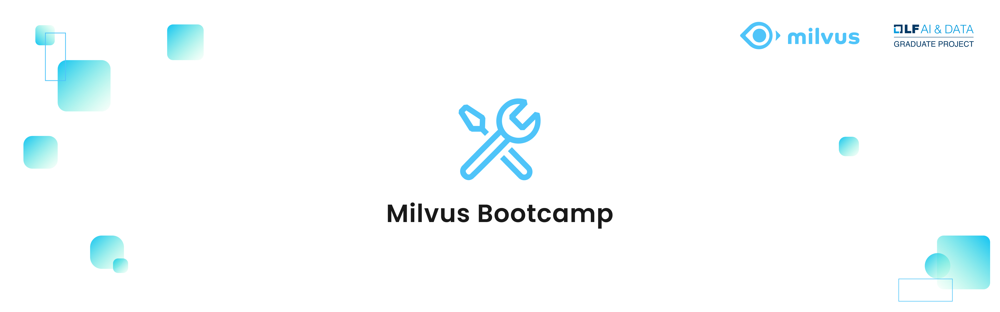

[![Contributors][contributors-shield]][contributors-url]
[![Forks][forks-shield]][forks-url]
[![Stargazers][stars-shield]][stars-url]

<!-- PROJECT LOGO -->
 

  

  

    The bootcamp for Milvus, including benchmarking, solutions, and application scenarios.
     
     
    <a href="https://github.com/milvus-io/bootcamp "Demo</a>
    ·
    <a href="https://github.com/milvus-io/bootcamp/issues">Report Bug</a>
    ·
    <a href="https://github.com/milvus-io/bootcamp/issues">Request Feature</a>
  

<!-- TABLE OF CONTENTS -->

  
Table of Contents

  <ol>
    <li>
      <a href="#about-milvus-bootcamp">About Milvus Bootcamp</a>
    </li>
    <li>
      <a href="#benchmark-tests">Benchmark Tests</a>
      <ul>
        <li><a href="#1m-test">1 million benchmark testing</a></li>
        <li><a href="#100m-test">100 million benchmark testing</a></li>
      </ul>
    </li>
    <li><a href="#solutions">Solutions</a></li>
      <ul>
        <li><a href="#try-it">Have a try</a></li>
        <li><a href="#run-in-local">Run locally</a></li>
        <li><a href="#live-demo">Live demo</a></li>
        <li><a href="#try-it">Have a try</a></li>
      </ul>
    <li><a href="#collaborations">Collaborations</a></li>
    <li><a href="#supports">Supports</a></li>
    <li><a href="#contributors">All contributors</a></li>
  </ol>

<!-- ABOUT MILVUS Bootcamp -->

## :mega: About Milvus Bootcamp
Milvus Bootcamp is designed to expose users to both the simplicity and depth of [Milvus](https://milvus.io/) vector database. Discover how to run benchmark tests as well as build similarity search applications spanning chatbots, recommendation systems, reverse image search, molecular search, and much more.

<!-- BENCHMARK TESTS-->

## :mag: Benchmark Tests
The [benchmark directory](https://github.com/milvus-io/bootcamp/tree/master/benchmark_test) contains 1 million and 100 million vector benchmark tests that indicate how your system will react to differently sized datasets.
 ### :dart: 1 million benchmark testing

 ### :art: 100 million benchmark testing

## :pencil: Solution

### :clapper: Live demo

### :fries: Have a Try

### :icecream: Run locally

## :two_women_holding_hands: Collaborations

## :fire: Supports

## :heart: All contributors

<!-- MARKDOWN LINKS & IMAGES -->
<!-- https://www.markdownguide.org/basic-syntax/#reference-style-links -->

[contributors-shield]: https://img.shields.io/github/contributors/github_username/repo.svg?style=for-the-badge
[contributors-url]: https://github.com/milvus-io/bootcamp/graphs/contributors
[forks-shield]: https://img.shields.io/github/forks/github_username/repo.svg?style=for-the-badge
[forks-url]: https://github.com/milvus-io/bootcamp/network/members
[stars-shield]: https://img.shields.io/github/stars/github_username/repo.svg?style=for-the-badge
[stars-url]: https://github.com/milvus-io/bootcamp/stargazers

